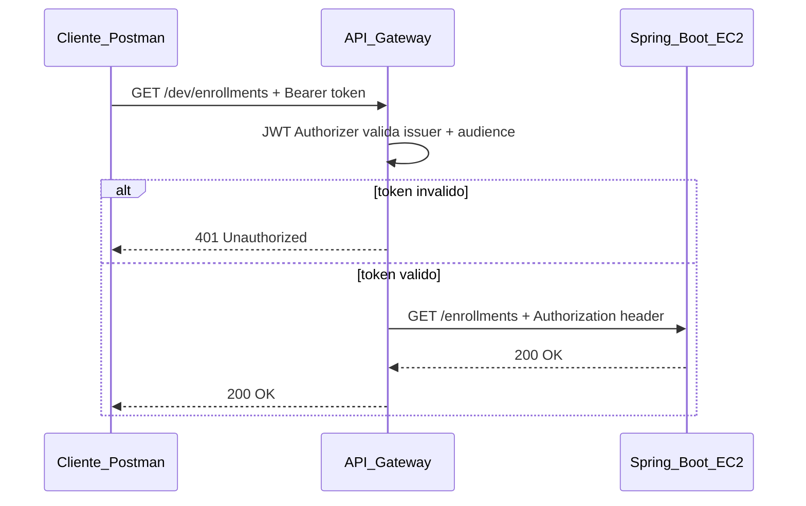
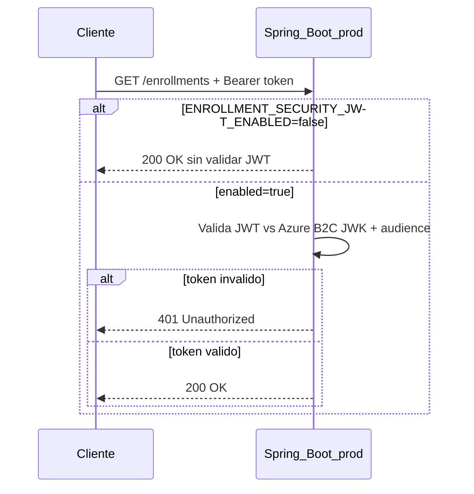
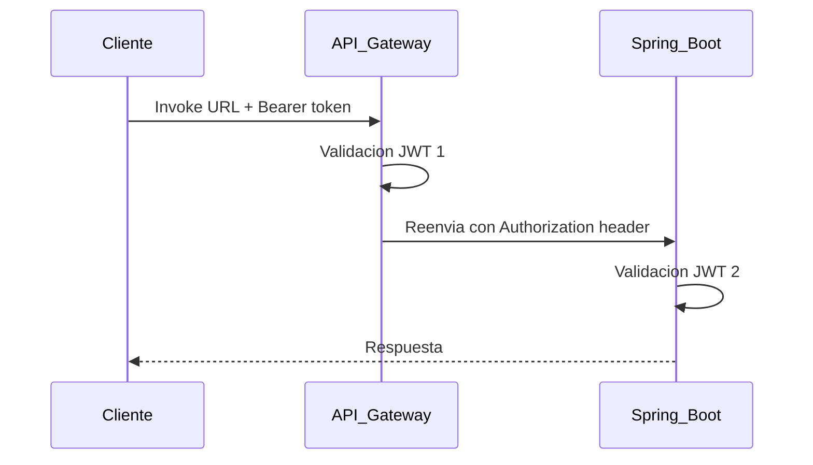

# Seguridad JWT con Azure AD B2C

Este documento describe las dos capas de seguridad disponibles para proteger la API de Enrollment Platform, cómo activar/desactivar la validación JWT en Spring Boot, y qué ocurre cuando ambas capas están activas al mismo tiempo.

Ver también: [guia-despliegue-ec2.md](guia-despliegue-ec2.md) para secrets de GitHub Actions.

---

## Capas de seguridad disponibles

| Capa | Dónde valida | URL de acceso | Activación |
| ---- | ------------ | ------------- | ---------- |
| **AWS API Gateway** | Borde (antes del backend) | `https://<api-id>.execute-api.<region>.amazonaws.com/<stage>/...` | JWT Authorizer en consola AWS |
| **Spring Boot** | Aplicación (EC2 :8080) | `http://<IP_EC2>:8080/...` | `ENROLLMENT_SECURITY_JWT_ENABLED=true` |

---

## Diagrama 1 — Seguridad en API Gateway (borde)



El cliente **nunca** usa la IP de EC2 directamente. API Gateway reenvía la petición al backend conservando el header `Authorization`.

Configuración típica en Gateway:

- Ruta proxy: `ANY /{proxy+}` → `http://<IP_EC2>:8080/{proxy}`
- JWT Authorizer con issuer y audience de Azure AD B2C
- Stage: `dev` (u otro)

---

## Diagrama 2 — Seguridad en Spring Boot (aplicación)



Por defecto la seguridad Spring está **desactivada** (`ENROLLMENT_SECURITY_JWT_ENABLED=false`). La app acepta peticiones sin token en perfil `prod` hasta que se active explícitamente.

---

## Ambas capas activas simultáneamente



### Qué implica

- El **mismo** access token de Azure AD B2C se valida **dos veces** (firma, expiración, audience).
- Más latencia por request (normalmente pocos milisegundos).
- Configuración duplicada: issuer/audience deben coincidir en Gateway y Spring.
- Si Gateway acepta el token pero Spring lo rechaza (config desalineada), el cliente recibe **401 desde el backend** aunque Gateway haya validado.

### Cuándo tiene sentido

| Escenario | Recomendación |
| --------- | ------------- |
| Clientes usan solo Invoke URL de Gateway | JWT solo en Gateway; Spring desactivado |
| EC2 :8080 expuesto a internet | Spring JWT activo como defensa si alguien bypass Gateway |
| Producción madura con VPC Link | JWT solo en Gateway; EC2 no accesible desde internet |

---

## Activar / desactivar seguridad Spring

### Desactivada (default)

```bash
# Omitir la variable o explícitamente:
ENROLLMENT_SECURITY_JWT_ENABLED=false
```

La API en EC2 responde sin exigir token. Los tests locales y CI usan este modo implícitamente (perfil `local`).

### Activada

```bash
ENROLLMENT_SECURITY_JWT_ENABLED=true
AZURE_B2C_JWK_SET_URI=https://<tenant>.b2clogin.com/<tenant>.onmicrosoft.com/<policy>/discovery/v2.0/keys
AZURE_B2C_AUDIENCE=<client-id-de-la-app-en-azure>
```

Si `ENROLLMENT_SECURITY_JWT_ENABLED=true` y faltan `AZURE_B2C_JWK_SET_URI` o `AZURE_B2C_AUDIENCE`, la aplicación **no arranca** (fail-fast).

Ruta pública sin token cuando Spring JWT está activo: `GET /actuator/health`.

---

## Variables de entorno

| Variable | Default | Descripción |
| -------- | ------- | ----------- |
| `ENROLLMENT_SECURITY_JWT_ENABLED` | `false` | Activa validación JWT en Spring (solo perfil `prod`) |
| `AZURE_B2C_JWK_SET_URI` | — | URL de claves públicas del user flow B2C |
| `AZURE_B2C_AUDIENCE` | — | Client ID de la app registrada en Azure |
| `ENROLLMENT_SECURITY_LOG_LEVEL` | `INFO` | Nivel de log de Spring Security (`TRACE`, `DEBUG`, etc.) |

Ejemplo de `AZURE_B2C_JWK_SET_URI`:

```text
https://tenantsemana4.b2clogin.com/tenantsemana4.onmicrosoft.com/B2C_1_RegistroLogin/discovery/v2.0/keys
```

---

## Ejemplos Postman

### Solo API Gateway (Spring JWT desactivado)

```http
GET https://<api-id>.execute-api.us-east-1.amazonaws.com/dev/enrollments
Authorization: Bearer <access_token>
```

Gateway valida el token. Spring no exige autenticación.

### Solo Spring Boot (sin Gateway)

```http
GET http://<IP_EC2>:8080/enrollments
Authorization: Bearer <access_token>
```

Requiere `ENROLLMENT_SECURITY_JWT_ENABLED=true` y variables Azure configuradas.

### Ambas capas activas

Misma request que el ejemplo de Gateway. Gateway valida primero; Spring valida de nuevo al recibir el header reenviado.

### Sin token (Spring activo)

```http
GET http://<IP_EC2>:8080/enrollments
```

Respuesta esperada: **401 Unauthorized**.

---

## Implementación en el código

La configuración vive en [`SecurityConfiguration.java`](../src/main/java/com/duoc/enrollmentplatform/factory/SecurityConfiguration.java):

- `enrollment.security.jwt.enabled=false` → `permitAll()` en todos los endpoints
- `enrollment.security.jwt.enabled=true` → OAuth2 Resource Server JWT + `/actuator/health` público

Propiedades en [`application-prod.properties`](../src/main/resources/application-prod.properties).

---

## Tabla de verificación

| Escenario | URL | `ENABLED` | Token | Esperado |
| --------- | --- | --------- | ----- | -------- |
| Local dev | `localhost:8080/courses` | false | — | 200 |
| EC2 directo | `IP:8080/enrollments` | true | Bearer válido | 200 |
| EC2 directo | `IP:8080/enrollments` | true | sin token | 401 |
| Gateway | Invoke URL `/dev/enrollments` | false | Bearer válido | 200 |
| Gateway + Spring | Invoke URL | true | Bearer válido | 200 |
