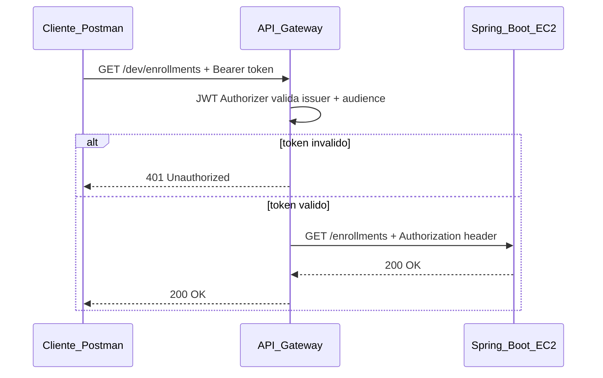
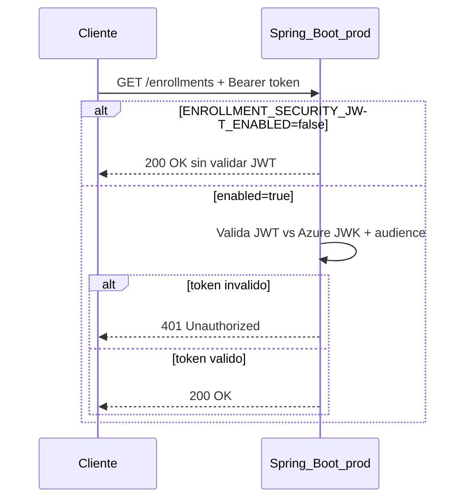
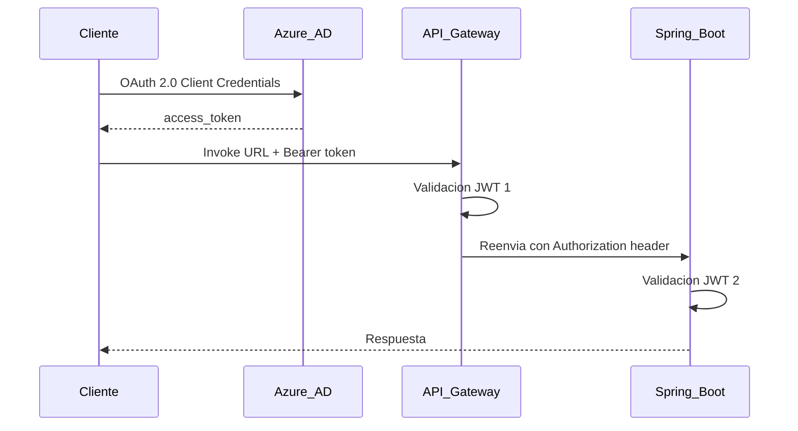

# Seguridad JWT con Azure AD (IDaaS)

Este documento describe las **dos capas de seguridad disponibles** para proteger la API de Enrollment Platform, **cómo activar/desactivar** la validación JWT en Spring Boot, y **qué ocurre cuando ambas capas están activas al mismo tiempo**.

Ver también: [guia-despliegue-ec2.md](guia-despliegue-ec2.md) para secrets en GitHub Actions.

---

## Capas de seguridad disponibles

| Capa | Dónde valida | URL de acceso | Activación |
| ---- | ------------ | ------------- | ---------- |
| **AWS API Gateway** | Borde (antes del backend) | `https://<api-id>.execute-api.<region>.amazonaws.com/<stage>/...` | JWT Authorizer en consola AWS |
| **Spring Boot** | Microservicio (EC2 :8080) | `http://<IP_EC2>:8080/...` | `ENROLLMENT_SECURITY_JWT_ENABLED=true` |

Cada capa es **independiente y configurable**. Puedes usar solo Gateway, solo Spring, o ambas.

### Configuración de producción (recomendada)

En **producción** usamos la configuración **más fuerte: ambas capas activas**.

```
Cliente → Azure AD (token) → API Gateway (validación 1) → Spring Boot (validación 2) → endpoint
```

- **API Gateway** — endpoints inscritos vía `ANY /{proxy+}` con JWT Authorizer.
- **Spring Security** — autenticación IDaaS en el microservicio (OAuth2 Resource Server).
- El **mismo** access token de Azure se valida en Gateway y en Spring.

En perfil `prod`, JWT Spring está **activado por defecto** (`ENROLLMENT_SECURITY_JWT_ENABLED=true`).

### Cuándo usar qué

| Escenario | Gateway | Spring JWT | Recomendación |
| --------- | ------- | ---------- | ------------- |
| **Producción** | Activo | Activo (`true`) | Configuración más fuerte — **default actual** |
| Solo Invoke URL, EC2 no expuesto | Activo | Opcional | Gateway suficiente en el borde |
| EC2 :8080 expuesto a internet | Activo | Activo | Spring como defensa si alguien bypass Gateway |
| Desarrollo local / CI | — | Desactivado | Perfil `local`, tests sin token |

---

## Diagrama 1 — Seguridad en API Gateway (borde)

Spring JWT **desactivado**. Gateway valida; Spring no exige token.



El cliente debe usar la **Invoke URL** del Gateway. API Gateway reenvía la petición al backend conservando el header `Authorization`.

Configuración típica:

- Ruta proxy: `ANY /{proxy+}` → `http://<IP_EC2>:8080/{proxy}`
- JWT Authorizer con issuer y audience de Azure AD
- Stage: `dev` (u otro)

---

## Diagrama 2 — Seguridad en Spring Boot (aplicación)

Acceso **directo a EC2**, sin Gateway. Spring valida el JWT.



Requiere `ENROLLMENT_SECURITY_JWT_ENABLED=true` y variables Azure configuradas.

---

## Ambas capas activas simultáneamente

**Configuración de producción.** El mismo token se valida dos veces.



### Qué implica

- El **mismo** access token de Azure AD se valida **dos veces** (firma, expiración, audience).
- Más latencia por request (normalmente pocos milisegundos).
- Configuración duplicada: issuer/audience deben coincidir en Gateway y Spring.
- Si Gateway acepta el token pero Spring lo rechaza (config desalineada), el cliente recibe **401 desde el backend** aunque Gateway haya validado.

---

## Endpoints inscritos en API Gateway

Con la ruta **`ANY /{proxy+}`** no hace falta registrar cada endpoint individualmente:

| Método | Path en Gateway | Backend Spring |
| ------ | ---------------- | -------------- |
| GET/POST | `/dev/courses` | `/courses` |
| GET/POST/PUT/DELETE | `/dev/enrollments` | `/enrollments` |
| GET/POST/PUT/DELETE | `/dev/enrollments/{id}/summary` | `/enrollments/{id}/summary` |
| GET | `/dev/enrollments/summaries` | `/enrollments/summaries` |

---

## Spring Security en el microservicio

Dependencias en [`pom.xml`](../pom.xml):

- `spring-boot-starter-security`
- `spring-boot-starter-oauth2-resource-server`
- `spring-security-test` (scope test)

Implementación en [`SecurityConfiguration.java`](../src/main/java/com/duoc/enrollmentplatform/factory/SecurityConfiguration.java):

- `enrollment.security.jwt.enabled=true` → OAuth2 Resource Server JWT en todos los endpoints
- Excepción pública: `GET /actuator/health`
- Fail-fast si faltan variables Azure al arrancar

Con `ENROLLMENT_SECURITY_JWT_ENABLED=false` **no hace falta** definir `AZURE_B2C_*`: la auto-configuración OAuth2 de Spring Boot está excluida y no se crea `JwtDecoder`.

---

## Activar / desactivar seguridad Spring

### Activada (default en prod)

```bash
ENROLLMENT_SECURITY_JWT_ENABLED=true
AZURE_B2C_JWK_SET_URI=https://login.microsoftonline.com/enrollmentplatform.onmicrosoft.com/discovery/v2.0/keys
AZURE_B2C_AUDIENCE=21bae56f-a579-4687-a0e8-b1f341d8d881
```

Si `ENROLLMENT_SECURITY_JWT_ENABLED=true` y faltan `AZURE_B2C_JWK_SET_URI` o `AZURE_B2C_AUDIENCE`, la aplicación **no arranca** (fail-fast).

Ruta pública sin token cuando Spring JWT está activo: `GET /actuator/health`.

Los valores deben coincidir con el **JWT Authorizer** de API Gateway (mismo issuer/audience).

### Desactivada (local / pruebas)

```bash
ENROLLMENT_SECURITY_JWT_ENABLED=false
```

La API en EC2 responde sin exigir token. Los tests locales y CI usan este modo implícitamente (perfil `local`).

Útil para diagnosticar sin Azure. **No recomendado en producción** si el puerto 8080 es accesible desde internet.

---

## Variables de entorno

| Variable | Default prod | Descripción |
| -------- | ------------ | ----------- |
| `ENROLLMENT_SECURITY_JWT_ENABLED` | `true` | Activa validación JWT en Spring |
| `AZURE_B2C_JWK_SET_URI` | — | Requerido en prod. URL del JWK set de Azure AD |
| `AZURE_B2C_AUDIENCE` | — | Requerido en prod. Client ID (mismo audience que API Gateway) |
| `ENROLLMENT_SECURITY_LOG_LEVEL` | `INFO` | Nivel de log de Spring Security |

> Los nombres `AZURE_B2C_*` son históricos; aplican tanto a Azure AD como a Azure AD B2C.

---

## GitHub Actions — secrets requeridos

En **Settings → Secrets and variables → Actions**, agregar:

| Secret | Valor |
| ------ | ----- |
| `ENROLLMENT_SECURITY_JWT_ENABLED` | `true` |
| `AZURE_B2C_JWK_SET_URI` | `https://login.microsoftonline.com/enrollmentplatform.onmicrosoft.com/discovery/v2.0/keys` |
| `AZURE_B2C_AUDIENCE` | `21bae56f-a579-4687-a0e8-b1f341d8d881` |

Opcional:

| Secret | Valor |
| ------ | ----- |
| `ENROLLMENT_SECURITY_LOG_LEVEL` | `DEBUG` (solo para diagnóstico) |

El workflow [`.github/workflows/docker-deploy.yml`](../.github/workflows/docker-deploy.yml) inyecta estas variables en el contenedor EC2.

Pasos después de agregar los secrets:

1. Push a `main` (dispara deploy).
2. Verificar `http://<IP_EC2>:8080/actuator/health` → 200 sin token.
3. Verificar `http://<IP_EC2>:8080/courses` sin token → **401**.
4. Verificar Invoke URL Gateway con Bearer token → **200**.

---

## Ejemplos Postman

### Solo API Gateway (Spring JWT desactivado)

```http
GET https://<api-id>.execute-api.us-east-1.amazonaws.com/dev/enrollments
Authorization: Bearer <access_token>
```

Gateway valida el token. Spring no exige autenticación.

### Solo Spring Boot (sin Gateway)

```http
GET http://<IP_EC2>:8080/enrollments
Authorization: Bearer <access_token>
```

Requiere `ENROLLMENT_SECURITY_JWT_ENABLED=true` y variables Azure configuradas.

### Ambas capas activas (producción)

```http
GET https://jasw0vwrjl.execute-api.us-east-1.amazonaws.com/dev/enrollments
Authorization: Bearer <access_token_de_azure>
```

Gateway valida primero; Spring valida de nuevo al recibir el header reenviado.

### Sin token (Spring activo)

```http
GET http://<IP_EC2>:8080/enrollments
```

Respuesta esperada: **401 Unauthorized**.

### Desarrollo local (JWT desactivado)

Perfil `local` no exige token. Para probar JWT en local:

```bash
ENROLLMENT_SECURITY_JWT_ENABLED=true \
AZURE_B2C_JWK_SET_URI=https://login.microsoftonline.com/enrollmentplatform.onmicrosoft.com/discovery/v2.0/keys \
AZURE_B2C_AUDIENCE=21bae56f-a579-4687-a0e8-b1f341d8d881 \
./mvnw spring-boot:run -Dspring-boot.run.profiles=local
```

---

## Tabla de verificación

| Escenario | URL | `ENABLED` | Token | Esperado |
| --------- | --- | --------- | ----- | -------- |
| Local dev | `localhost:8080/courses` | false | — | 200 |
| Health check | `IP:8080/actuator/health` | true | — | 200 |
| EC2 directo | `IP:8080/courses` | true | — | 401 |
| EC2 directo | `IP:8080/courses` | true | Bearer válido | 200 |
| Gateway | Invoke URL `/dev/courses` | false | Bearer válido | 200 |
| Gateway + Spring | Invoke URL | true | Bearer válido | 200 |
| Gateway + Spring | Invoke URL | true | sin token | 401 |
